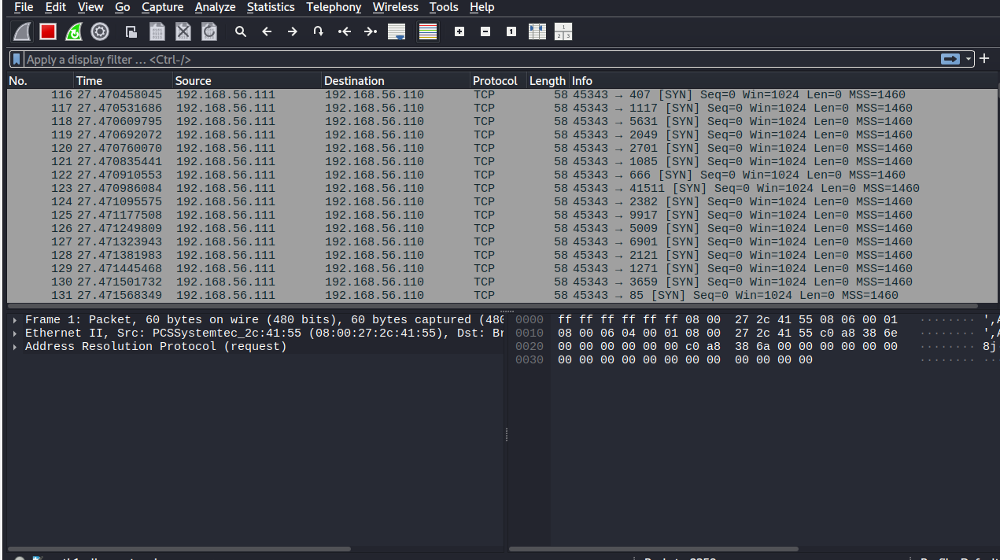
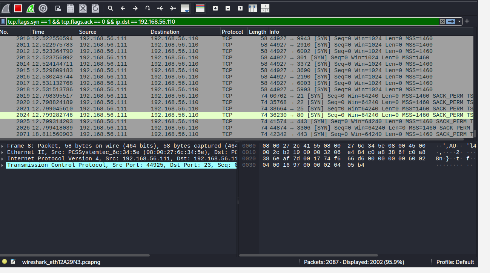
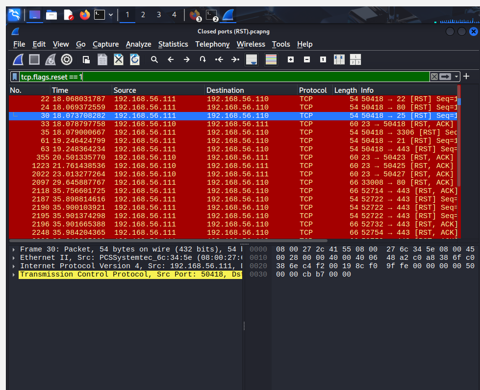
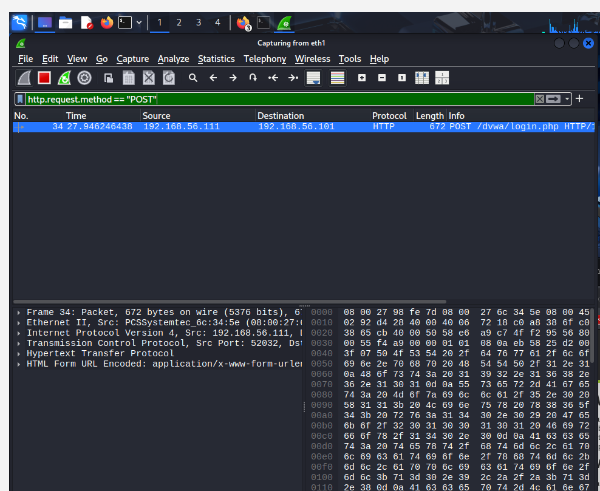
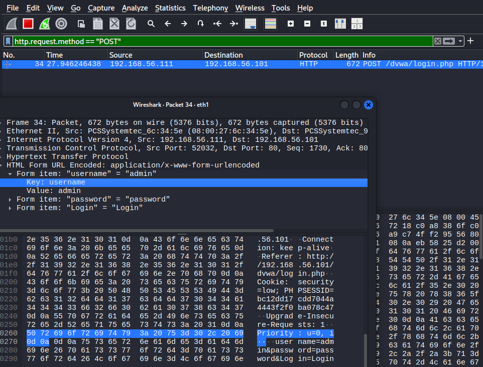
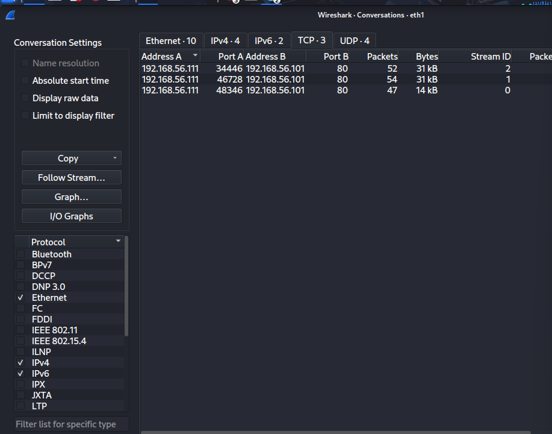
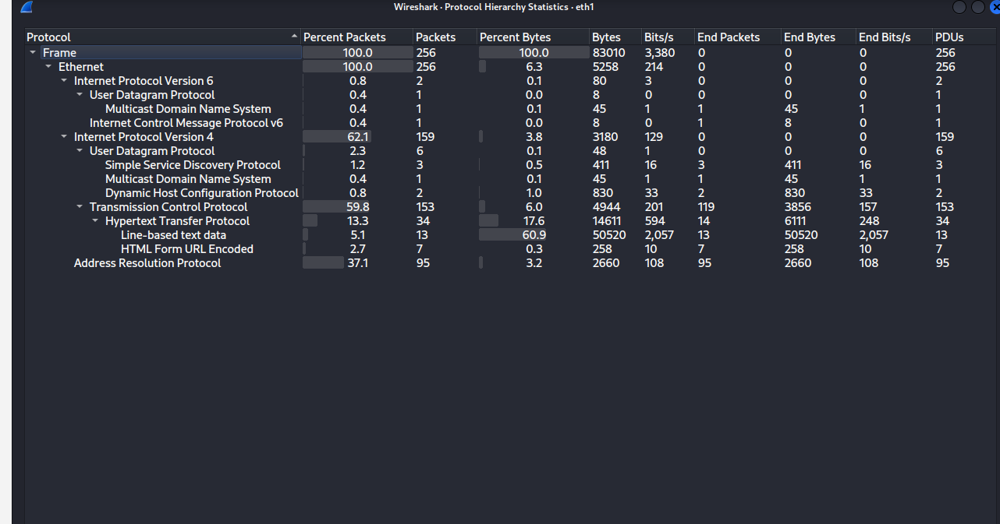

Wireshark Network Traffic Analysis Lab
Objective

To capture and analyze network traffic using Wireshark, focusing on reconnaissance detection, packet inspection, and identifying security vulnerabilities through packet-level inspection.

Tools Used
Wireshark
Kali Linux
Nmap
DVWA (Damn Vulnerable Web Application)

 Scenario 1: Nmap SYN Scan Analysis

A TCP SYN scan was performed to identify open ports on the target system.

Key Findings:

SYN packets detected using:

tcp.flags.syn == 1 && tcp.flags.ack == 0
Open ports identified via SYN-ACK responses:
80 (HTTP)
443 (HTTPS)
Closed ports identified via RST responses:
23 (Telnet)

### Screenshots:

SYN scan detection using Wireshark filter:

Open ports identified via SYN-ACK responses:

Closed ports identified via RST responses:

 Scenario 2: HTTP Credential Analysis

Captured HTTP authentication traffic revealed plaintext credential transmission.

Key Findings:

POST request detected:

http.request.method == "POST"

Credentials exposed:

username=admin
password=password

Data transmitted using:

application/x-www-form-urlencoded
No encryption used (HTTP instead of HTTPS)
### Screenshots:
HTTP POST request captured:

Credentials exposed in packet payload:

Scenario 3: TCP Conversation Analysis

TCP conversation analysis was used to examine communication patterns between attacker and target.

Key Findings:
Multiple TCP streams observed between:
192.168.56.111 (attacker)
192.168.56.101 (target)
Different source ports indicate multiple sessions:
34446
46728
48346
Packet counts (47–54 packets per stream) indicate active communication
Data transfer (14KB–31KB) confirms web interaction and content delivery
Communication follows a client-server model:
Client sends requests (small packets)
Server responds with larger payloads

 Scenario 4: Protocol Hierarchy Analysis

Protocol hierarchy statistics were used to analyze traffic composition.

Key Findings:
IPv4 traffic dominates:
~62% of packets
TCP is the primary protocol:
~60% of packets
HTTP traffic present:
~13% of packets
~17% of bytes
Line-based text data:
~60% of bytes
Indicates transmission of readable content (HTML, credentials)

HTML form data detected:

application/x-www-form-urlencoded
ARP traffic (~37%) represents normal network activity
Minor UDP traffic includes:
DNS
DHCP
SSDP
### Screenshots:

Security Findings
Plaintext credential transmission over HTTP
Lack of HTTPS encryption
Credentials easily interceptable via packet sniffing
Detectable reconnaissance activity (SYN scan)
Multiple exposed services (HTTP, HTTPS)

 Conclusion

This project demonstrates how attackers generate identifiable network patterns and how defenders can analyze packet-level traffic to detect reconnaissance activity, identify open ports, and uncover critical security vulnerabilities such as plaintext credential transmission.

Through the use of Wireshark, it is possible to reconstruct sessions, inspect payloads, and gain deep visibility into network behavior, reinforcing the importance of secure communication protocols such as HTTPS.

 Project Files
Full packet captures available in /captures
Screenshots provided for each analysis phase
All analysis performed using Wireshark display filters

Key Skills Demonstrated
Network traffic analysis
Packet inspection and filtering
TCP/IP protocol understanding
Threat detection (reconnaissance & credential exposure)
Wireshark proficiency
